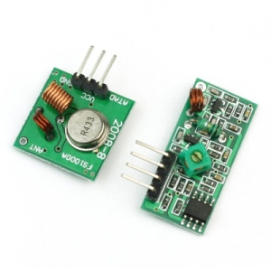
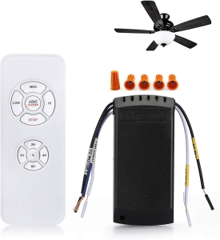

# Romote-Control-Fan-ESPHOME
## ESPHome controlled Ceiling Fan.

## Please note: Home Assistant receives NO feedback from the fan, so it can't 'know' the actual state of the fan, this is for control only.

This setup uses an ESP8266 and 433 Mhz RF Receiver and Transmitter Modules. Actually, just the
Transmitter Module.

I bought a fan from Argos(UK) and it came with a remote control,  I have Home Assistant and wanted to operate the fan using automation, so I made this.

This is the remote control, can also be bought from Amazon, I think it's a generic QIACHIP.

I hope you find it useful.

The receiver is not needed, it is commented out, but I left it in there just in case :)
The receivers data pin is connected to pin GPIO01
The transmitters data pin is connected to pin GPIO04

## What we end up with is
- 3 speed fan with low, medium and high settings
- 1 button for the Big light (This is a toggle, HA can't know the state of the light)